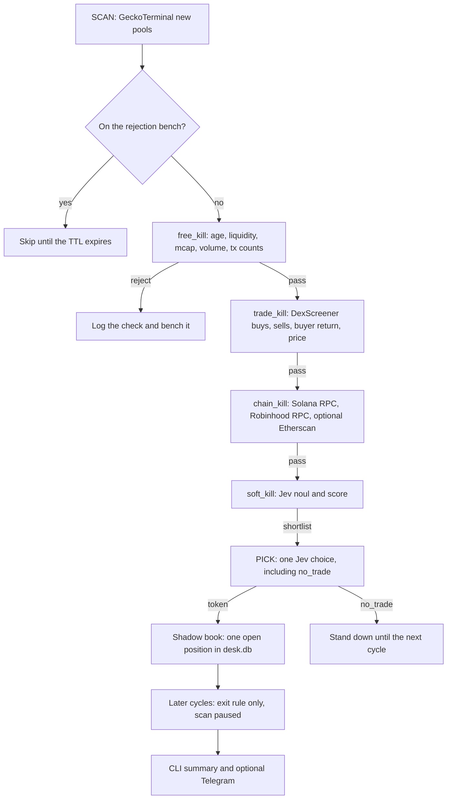

# KillDesk

Shadow-mode memecoin desk for Solana, BSC, and Robinhood Chain. Each cycle
lists fresh pools, kills the ones a comparison can already reject, asks
[Jev](https://docs.typesafe.ai) for typed judgements on whatever is left, and
records at most one paper position. It does not place orders and it does not
hold wallet keys.

Inspired by [@savipww](https://x.com/savipww)'s public write-up of a crawler +
Jev desk (September–October 2026). This repo copies the shape of that desk:
typed judgements, a kill funnel, one position, a rejection bench. It does not
copy the FOMO session scraper or the live order path.

**thejevai.com is not the official TypeSafe site.** The API is
[https://api.typesafe.ai](https://api.typesafe.ai) and the console is
[https://console.typesafe.ai](https://console.typesafe.ai).

This is shadow / paper trading only. It is not financial advice. Thresholds
are a starting shape, not a strategy. Do your own research.

## Architecture



Code computes every number and passes it in as a field. Jev returns a
probability, a choice, or a score. Plain facts such as an open mint authority
or a honeypot marker are comparisons in `filter.py`, not questions.

While a shadow position is open the scan does not run. The exit rule is
take-profit, stop-loss, or max hold. It does not ask the model.

## Setup

Python 3.11+.

```bash
pip install -e ".[dev]"
cp .env.example .env
```

| Variable | Required | What it does |
| --- | --- | --- |
| `TYPESAFE_API_KEY` | for live Jev | Bearer token for `POST https://api.typesafe.ai/v1/systemone` |
| `OPENROUTER_API_KEY` | alternative | Same request shape at `https://openrouter.ai/api/v1/systemone` |
| `KILLDESK_JUDGE_BACKEND` | no | `typesafe` (default when that key is set), `openrouter`, or `mock` |
| `ETHERSCAN_API_KEY` | no | BSC source and holder checks via Etherscan V2 `chainid=56`. Omitted, BSC still runs on public RPC and degrades |
| `TELEGRAM_BOT_TOKEN` / `TELEGRAM_CHAT_ID` | no | Cycle summary. Skipped when either is empty |
| `SOLANA_RPC_URL` | no | Defaults to the public Solana RPC, with a publicnode fallback |
| `KILLDESK_DB` | no | SQLite path, default `desk.db` |

The judge client is the official `typesafe-sdk` (`AsyncTypeSafeClient`). If
that package is missing, KillDesk posts the same JSON with httpx. `--mock`
uses `MockJev` and needs no key. Mock responses still go through the same
validator: the choice is one of the options, probabilities sum to about 1,
and `model` is a version string (`jev-mock-1.0.0`), not the `jev-latest` alias.

## Run

One cycle against the recorded fixtures (no network, no key):

```bash
killdesk run --once --mock --fixtures tests/fixtures/cycle
```

One cycle against the live public APIs, with the mock judge:

```bash
killdesk run --once --mock
```

One cycle with a real Jev key:

```bash
killdesk run --once
```

Daemon, default every 15 minutes:

```bash
killdesk run --mock
```

`--shadow` is on by default. `--no-shadow` exits immediately. `Executor.submit`
raises `NotImplementedError`. There is no order path in this MVP.

Shadow book and rejection stats:

```bash
killdesk report
killdesk report --db desk.db
```

The report prints realized shadow P&L, hit rate on priced closes, the open
position if there is one, and rejection counts by check.

## Tune

Every cutoff lives in `killdesk/thresholds.py`. Edit `Thresholds` and leave
the filters alone.

The funnel order is the point:

1. `free_kill` uses the pool listing only. No extra request.
2. `trade_kill` is one DexScreener batch per chain (up to 30 tokens).
3. `chain_kill` spends at most `max_dossiers` (default 3) chain dossiers.
4. `soft_kill` thresholds Jev's `rug_risk`, `holder_concentration_danger`,
   `momentum_quality`, and `recycled_account` when a Twitter handle was
   already on the token info.

Questions are grouped into one call per token in `killdesk/questions.py`,
with a separate set for Solana, BSC, and Robinhood Chain. `recycled_account`
is omitted when there is no handle. The desk does not search X for one.

Rejection TTLs are on `Thresholds.rejection_ttl_seconds`. `honeypot`,
`mint_authority_open`, `freeze_authority_open`, and `no_contract` do not
expire. `too_early` lasts one hour. Anything not listed lasts
`default_rejection_ttl_seconds`.

`kill_open_owner` defaults to on. New EVM launches often still have an
owner; that is the first switch to loosen if the chain stage kills
everything you would have kept.

GeckoTerminal's published public cap is 30 calls per minute. This desk
budgets 10 (`gecko_calls_per_minute`) so a page of listings per chain still
leaves room for dossier calls. Raise `--pages` only if you lower the dossier
cap or accept waiting on the bucket.

## Cost

Jev charges about **$0.042 per 1 million input tokens**. Output tokens are
free. State is billed once per call, so each token's questions go out
together, plus one pick over the shortlist (at most 10 names, plus
`no_trade`). Three dossiers and one pick are a few thousand input tokens.
DexScreener and GeckoTerminal are free. A cycle that picks `no_trade` is a
normal result.

## Data sources

- GeckoTerminal public API, `new_pools` and token info. No key.
- DexScreener `tokens/v1`. No key.
- Solana public RPC: `getAccountInfo`, `getTokenSupply`, `getTokenLargestAccounts`.
- Robinhood Chain RPC `https://rpc.mainnet.chain.robinhood.com` (chain id
  4663). Requests send a browser User-Agent; without it the RPC returns 403.
- BSC public RPC, plus optional Etherscan V2. Holder list and some pro
  endpoints fail closed: the cycle logs the miss and continues.
- No FOMO scraping, no browser-session tokens, no wallet keys.

Top-holder concentration excludes the single largest token account when a
second account exists, because that account is usually the pool. Both the
raw and the excluded fractions are passed to Jev. A lone account is not
excluded.

## Failure behaviour

Retries with backoff on timeouts, HTTP 429, and 5xx responses (including 529).
Each source has its own circuit breaker. A dead Solana listing does not
abort BSC or Robinhood, and a failed judge call benches that token for 15
minutes instead of crashing the cycle. The daemon logs an unexpected crash
and waits for the next interval.

## Tests

```bash
ruff check .
pytest
```

CI runs both. Tests use the JSON under `tests/fixtures/cycle` and httpx
mocks. They do not call the network.

## Layout

```
killdesk/
  collect.py    scan and DexScreener parsing
  filter.py     free_kill, trade_kill, chain_kill, soft_kill
  questions.py  per-chain Jev question sets and the pick
  thresholds.py every tunable number
  judge.py      SDK client, httpx client, OpenRouter, MockJev, validator
  pick.py       shortlist cap and the code-side baseline
  book.py       desk.db, one position, rejection bench
  notify.py     optional Telegram
  chains/       solana.py, bsc.py, robinhood.py
  main.py       killdesk run / killdesk report
  executor.py   stub that always refuses
```
